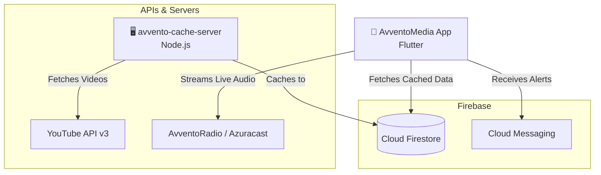

# AvventoMedia App

### Flying the Gospel to the Whole World

AvventoMedia is dedicated to spreading the gospel globally. Its content is branded as AvventoProductions on various platforms including YouTube, Facebook, SoundCloud, and Mixcloud. Additionally, it can be accessed on AvventoRadio at [radio.avventomedia.org](https://radio.avventomedia.org) and on free-to-air 3ABN Uganda Television.

---

## 📱 Features

- **AvventoRadio**: Listen to uplifting music, sermons, and live broadcasts 24/7.
- **Streaming TV**: Access live programs, shows, and music from AvventoMedia and 3ABN Uganda Television.
- **Podcasts & Audio Player**: Premium background-capable audio player with dynamic queues, drag-and-drop reordering, and speed controls.
- **YouTube Integration (Kids, Music, Main)**: Watch high-quality video content synced directly from the AvventoProductions YouTube channels.
- **Global Search**: Instantly search across Playlists, Videos, Live TV, and Radio with persistent local search history and fluid inline filters.

---

## 🏗 Infrastructure & Tech Stack

This project is built with modern, scalable architecture to ensure a seamless media streaming experience.



- **Frontend**: Flutter & Dart (Cross-platform iOS and Android)
- **State Management**: GetX & Provider
- **Audio/Video Playback**: `just_audio` (with background play support), `better_player`, and `youtube_player_flutter`.
- **Backend & Database**: Firebase Cloud Firestore.
- **Content Synchronization**: A custom Node.js `avvento-cache-server` syncs YouTube API data to Firestore to prevent API quota limits and ensure fast load times.
- **Push Notifications**: OneSignal

---

## 🚀 CI/CD & Deployment

This repository uses **GitHub Actions** for professional Continuous Integration and Continuous Deployment (CI/CD). 

Deployments are triggered **manually** via the GitHub Actions `workflow_dispatch`.

### Automated Pipeline Capabilities:
1. **Android Deployment**: Decodes Keystores on-the-fly, builds the signed `.aab`, and uploads directly to the Google Play Console internal/production tracks.
2. **iOS Deployment**: Sets up macOS keychains, decodes `.p12` certificates and provisioning profiles, builds the signed `.ipa`, and uploads directly to App Store Connect (TestFlight) using `altool`.

*(Note: Never commit your Keystores or Certificates. They must be stored as Base64 strings in your GitHub Repository Secrets).*

---

## 🛠 Getting Started (Local Setup)

To run this project locally, you will need the following prerequisites:

1. **Flutter SDK**: `>=3.1.2 <4.0.0`
2. **Firebase Config**: You must obtain the `google-services.json` (Android) and `GoogleService-Info.plist` (iOS) from your Firebase Console and place them in their respective app directories.
3. **Environment Variables**: Create a `.env` file in the root directory for any sensitive local API keys.
4. **Run the App**:
   ```bash
   flutter pub get
   flutter run
   ```

---

## 📥 Get the App

Download the AvventoMedia app today:
- [Google Play Store](https://play.google.com/store/apps/details?id=tv.avventomedia.app)
- [Apple App Store](https://apps.apple.com/us/app/avventomedia/id6756179416)

---

## 📝 Recent Changelog

### Version 1.4.0 (May 2026)
- **Major UI Redesign**: Introduced premium frosted-glass cards, edge-to-edge thumbnails, and fluid animations.
- **Queue & Speed Bottom Sheets**: Replaced the clunky podcast player layout with sleek modal bottom sheets.
- **Search Overhaul**: Added persistent local search history and inline sub-category filtering chips.
- **Playlist Continuity**: Fixed audio looping; the player now smoothly auto-plays the next item in the queue.
- **CI/CD Integration**: Added professional GitHub Actions for automated store deployments.

### Version 1.3.0
- Refactoring explore to Carousel design.
- Complete UI/UX aesthetic upgrade.
